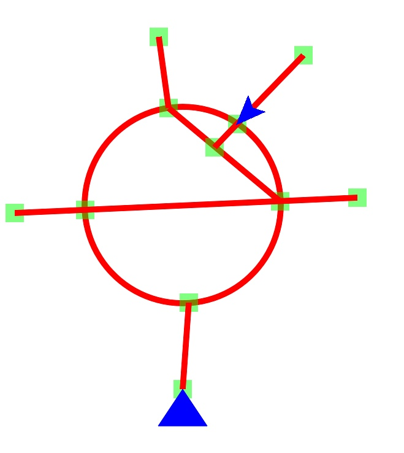

# CGPathIntersection

**CGPathIntersection** is a `CoreGraphics` library that identifies points where two `CGPath`s intersect.

Surprisingly, this is not provided out-of-the-box by `CoreGraphics`. Intersections can be calculated analtyically for simple geometric shapes (especially straight lines), but that method becomes rather challenging when considering a `CGPath` can be arbitrarily complex. `CGPathIntersection` solves this problem by rendering each path into an image and then finding the exact pixels where they intersect.

## Installation
You can use `CGPathIntersection` in your own projects through [Carthage](https://github.com/Carthage/Carthage).

Add `github "calda/CGPathIntersection"` to your Cartfile and run `carthage update`.

## Usage

```swift
import CGPathIntersection

let path1 = CGPath(...)
let path2 = CGPath(...)
        
path1.intersects(path: path2) //returns a boolean
path1.intersectionPoints(with: path2) //returns an array of points
```

If performing many calculations, you can increase performance by creating a `CGPathImage`. Any calculations performed on a pre-existing `CGPathImage` will run faster than the same calculation performed on a raw `CGPath`.

```swift
import CGPathIntersection

let pathImage = CGPathImage(from: CGPath(...))
let otherPathImages: [CGPathImage] = [...]

let intersectingPaths = otherPathImages.filter{ path.intersects(path: $0) }
```

## Example

CGPathIntersection was created as a component of **[Streets](http://github.com/calda/Streets)**, a SpriteKit game that simulates managing a network of streets. Streets uses CGPathIntersection to connect individual roads together with physical intersections. When a car reaches an intersection, it makes a random turn onto one of the other connected roads.

<p align="center">
     
</p>

Streets also has some support for more complex paths, like roundabouts:

<p align="center">
    
</p>
